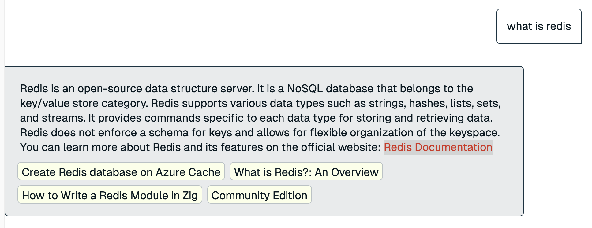

# Redis는 왜 빠를까?

COTATO 프로젝트를 하면서 회원 가입, 캐시, 선착순 요청 처리, 동시성 처리등 redis를 많은 부분에서 활용하고 있다. 최근 올라오는 백엔드 개발자 취업 공고에도 redis는 우대 사항이 아닌, **자격사항**에 포함된 경우가 많다.

레디스는 싱글스레드, 인메모리 DB등의 특징이 있는데 레디스가 주목받는 이유는 여러가지가 있지만 그 중 하나는 ‘빠른 속도’이다. 실제로 우리 서비스에 레디스를 사용하는 이유 중 하나도 ‘빠른 처리 속도’ 중 하나인데 정작 왜?에 대한 고민을 해보진 않을 것 같다.

실제 redis.io에도 Redis는 빠르다 빠르다 하는데 그 이유가 뭘까? 하는 고민을 하던 중 최범균님의 유튜브에 레디스가 빠른 5가지 이유라는 제목의 영상이 올라왔다.

[https://www.youtube.com/watch?v=HrQHb3iwbXE&t=30s](https://www.youtube.com/watch?v=HrQHb3iwbXE&t=30s)

이 글에선 해당 영상을 기반으로 Redis가 빠른 5가지 이유를 공부하고 정리해보도록 하겠다.

# Redis란?

우선 Redis의 정의를 생각해보자. Redis를 설명하는 여러 용어와 정의들이 있지만 가장 정확한 설명을 위해 [redis.io](https://redis.io/learn/develop/node/nodecrashcourse/whatisredis)에 들어가 검색해본 결과 아래와 같이 설명한다.

### 정의

Redis는 **REmote DIctionary Server**의 줄임말로 key-value형태의 NoSQL DB로 메모리에서 데이터를 저장하는 인메모리 DB이다.

보다 구체적인 설명은 아래 링크와 Youtube 영상에서 확인해보자.

https://redis.io/learn/develop/node/nodecrashcourse/whatisredis

# Redis가 빠른 이유

(백엔드 개발자를 준비하고 있다면 먼저 5가지 이유를 생각해보고 글을 읽기를 권장한다.)

## 1. 인메모리 DB

Redis는 연산 처리에 필요한 데이터를 메모리에 저장해서 처리한다. 당연히 디스크에 접근을 하지 않고 메모리에서만 데이터를 조회하기에 연산 속도의 이점을 가져올 수 있다.

그렇다면 Redis에 저장하는 데이터가 많아진다는 얘기는 디스크가 아닌 메모리에 저장되는 데이터가 많다는 이야기인데 Redis에 저장하는 값이 많아지면 서버가 터지지 않을까?

맞는 말이다. 실제로 서버의 메모리 한계를 넘어 데이터를 저장하면 OOM(OutOfMemoryError)이 발생할 수 있다. 이를 방지하기 위해 Redis는 Eviction이라는 정책을 사용한다.

### Eviction

Redis는 우선 maxmemory 설정을 통해 최대 메모리 할당량을 지정한다. 이후 저장하는 데이터가 많아져 maxmemory를 넘게 되면 설정된 Eviction 정책에 따라서 메모리가 부족할 때 자동으로 오래되거나 덜 중요한 데이터를 삭제한다.

- noeviction : 메모리 한계에 도달하면 더이상 저장하지 않음
- allkeys-lru : LRU(최근에 사용되지 않은)키를 제거한다.
- volatile-lru : 만료 설정이 되어있는 키 중 가장 최근에 사용되지 않은 키를 제거

이 외에도 allkeys-lfu, allkeys-random, volatile-lfu, volatile-random, volatile-ttl 등의 정책을 포함해 총 8가지 아래와 같은 정책 등이 있는데 구체적인 설명은 아래 글을 참고하자.

[https://redis.io/docs/latest/operate/rs/databases/memory-performance/eviction-policy/](https://redis.io/docs/latest/operate/rs/databases/memory-performance/eviction-policy/)

## 2. Key-Value NoSQL Database

Redis는 NoSQL DB이다. NoSQL DB는 4가지 종류(key-value, Document, Column Family, Graph)가 있는데 이 중 Hash Table을 사용한 Key-Value 형태의 데이터베이스이기에 속도에 이점이 있다.

1. Hash Table을 사용한 Key-Value 데이터베이스이기에 조회 성능이 O(1)로 매우 빠르다.
2. NoSQL의 DB로 ‘값’만을 관리하기에 RDB의 조인, 트랜잭션, 스키마 등에 대한 제약이 없다.

## 3. 싱글 스레드

레디스하면 가장 큰 또 하나의 특징은 ‘싱글 스레드로 동작한다’이다. 물론 Redis 6.0 이후와 일부 연산에선 여러 스레드 사용을 지원하려 노력하고 있다곤 하지만 기본적인 철학은 싱글 스레드로 동작이라고 한다.

운영체제에서 스레드를 배우고 멀티 스레드에 대한 공부를 하다보면 ‘컨텍스트 스위칭’ 과 ‘스레드 간의 자원 공유’에 대한 개념을 다루는데

1. 컨텍스트 스위칭이 없어서 빠르다
    
    우선, 싱글 스레드이기에 하나의 스레드가 다른 스레드와 교대되는 컨텍스트 스위칭에 대한 비용이 없어 효율적이다.
    
2. 스레드 간의 자원을 공유할 필요가 없다.
    
    일반적으로 스레드 간의 자원을 공유할 때 데이터의 정합성을 위해 Lock을 사용한다. 하지만 싱글 스레드는 이러한 비용이 들지 않는다.
    

나는 레디스의 정의를 ‘인메모리의 싱글 스레드를 사용하는 NoSQL DB’라고 생각하고 있었는데 영상을 보며 놀랐던 정의와 특징만 제대로 이해하고 있어도 Redis가 빠른 이유 3가지가 설명이 가능했다. ㄷㄷ

## 4. 용도에 따른 적절한 자료구조

Redis는 Value에 일반적인 String만이 존재하지 않는다. Sorted Set, List, Hash등 다양한 자료구조가 존재하고 내부적으로 효율적인 알고리즘을 구현해두었다. 따라서, 요구사항에 맞는 적절한 자료구조를 선택하면 연산 속도를 높일 수 있다.

가령, 레디스로 순위표를 많이들 구현한다. 이 때 Sorted Set을 활용하면 조회와 정렬을 한번에 해결할 수 있다는 장점이 있다.

## 5. 논블로킹 I/O와 I/O 다중화

Redis는 논 블로킹 I/O와 I/O 다중화를 통해 단일 스레드에서도 많은 클라이언트의 요청을 빠르게 처리할 수 있다.

우선 논블로킹 방식의 I/O 처리를 통해 읽기 또는 쓰기 작업이 완료되는 것을 기다리지 않고 바로 다른 작업을 처리한다. 가령 네트워크 데이터 송수신의 완료를 기다리지 않고 바로 다음 작업을 해 처리 속도를 높인다.

Redis는 이벤트 루프라는 구조를 사용해 단일 스레드내에서 여러 클라이언트의 IO 작업을 순차적으로 확인하고 처리한다.

또한, IO 다중화를 통해 하나의 스레드 또는 프로세스가 동시에 여러 입출력 소스를 감시하고 처리한다. 가령, Redis는 운영체제가 제공하는 epoll(Linux), kquee(macOS)등의 멀티플렉싱 기법을 사용한다.

[https://blog.naver.com/n_cloudplatform/222189669084](https://blog.naver.com/n_cloudplatform/222189669084)

# 느낀점

매일 특정 기술을 사용하는 이유를 알고 사용하는 ‘이유 있는 개발자'가 되고자 다짐한다. 레디스가 빠르고 싱글 스레드의 특징을 가지고 있기에 사용한다고 하지만, 정작 Redis가 왜 빠른지에 대한 생각은 해보지 못했는데 이 기회를 통해 고민해볼 수 있었다.

유튜브 영상 제목을 보고 5가지나 된다고 ..? 공부할게 많다는 생각으로 영상을 접했는데 이 중 1,2,3번 3가지는 내가 알고 있던 레디스의 정의와 특징만으로 답변할 수 있는 것들이었다. 

나중에 면접에서 꼬리 질문의 꼬리 질문으로 내가 모르는 것에 대한 질문을 받는다면 바로 모른다고 대답하기보단 정의와 특징을 먼저 생각해보고 이렇게 추론해보면 되지 않을까란 생각이 들 정도로 정의와 특징은 중요한 것 같다.

앞으로도 무언가를 공부할 때 해당 개념의 정의를 제대로 이해하고 공부해보도록 해야겠다.