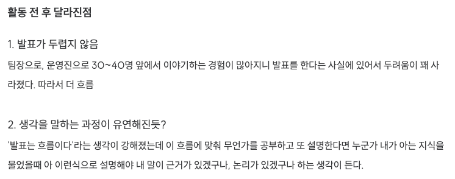
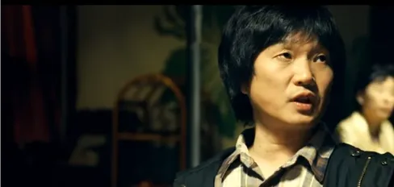

# 인력(引力)

~~다들 한자를 넣는 것 같길래 저도 넣어봤어요~~

최근 10기 데모데이를 다녀왔다. 10기로 활동을 하진 않았지만, 단기 스터디로 다시 9기 때부터 진행해온 `개발 블로그 쓰기 스터디` 를 맡아서 진행했고, 해당 스터디를 다음 기수에도 이어서, 그리고 규모를 조금 키워서 진행할 예정이기에 데모데이에 개블스 발표를 진행하려 참여했다.

같은 데모데이를 준비하며 주변에서 발표하는게 떨린다, 걱정된다라는 이야기를 하는 친구가 있었다. 

나에게 있어서 발표와 특히 사람들에게 앞에서 이야기 하는 것은 전혀 어렵지 않았다. 8기 교육팀과 운영진을 하고 프로젝트 팀장으로 1년 넘게 회의를 진행해오면서 이전에 실제 들었던 발표도 꽤 잘했다고 생각했기에 부담없이 하라고 다소 마음 편한 얘기를 했다.

나도 늘 하던대로 발표 준비를 하고 데모데이 장소에 도착했다. 도착한 순간부터 이상하게 떨리기 시작하더니 결국 너무 만족스럽지 않은 발표를 진행했고 조용히 집에 돌아갔다.

### 이상하게 발표가 어렵다

생각해보면 요즘 발표나 진행이 어렵다. 분명 내가 두렵지 않다고 생각한 영역이었는데.

교육팀 활동 회고록 중

매주 진행하던 회의도, 머리 속 생각을 질서 정연하게 이야기하던 개블스 발표도, 정확하겐 코테이토를 나가고, 잠깐이지만 취업을 하고 다시 돌아온 시기, 1월부터 스스로 깔끔하게 회의를 진행한 적은 없었다.

발표를 떠나서, 최근 두 달?간 사람들과 이야기 하는 것도 상당히 만족스럽지 않았다.

~~(심지어 그냥 대화하는 것도 어려웠습니다 … )~~

전반적으론 크게 2가지 부분이 만족스럽지 않았는데

1. 머리속 흐름이나 생각을 말하는 과정이 유연하다고 느껴지지 않았다.
2. 의사 결정할 때 기준이 사라진 느낌

팀장으로 팀원의 모든 의견을 수용할 수 없고, 의견에 반박을 할 때 가장 중요하게 생각하는게 근거를 제시하는 것이라고 생각하는데 새로운 기획 아이템을 정하는 등 의견이 갈릴 때 근거를 말하기가 어려웠다.

~~오히려 줏대 없어졌다라는 소리까지 들었으니~~

2시간도 부족하던 회의가 처음으로 1시간 반만에 소재 고갈이 되었던 적도 있다.

스스로는 이 어려움의 원인은 **`근거가 없어서`**라고 생각했다.

근거가 없어서 뭔가가 안 풀리니까 억지로 다른 방법을 찾아보고 그러는 과정에서 조금씩 본질과 내가 세운 기준들에서 멀어져갔다.

### 거짓말, 진정성의 부재

---

그렇게 데모데이를 끝낸 다음 주 ~~(사실 지난주)~~ 1주차 언급한 ‘[필독! 개발자 온보딩 가이드](https://search.shopping.naver.com/book/catalog/40170757618?cat_id=50010921&frm=PBOKPRO&query=%ED%95%84%EB%8F%85+%EA%B0%9C%EB%B0%9C%EC%9E%90+%EC%98%A8%EB%B3%B4%EB%94%A9+%EA%B0%80%EC%9D%B4%EB%93%9C&NaPm=ct%3Dm5zq4y9k%7Cci%3D9a646867e3a6a522179133b85b40b9bd071199ae%7Ctr%3Dboknx%7Csn%3D95694%7Chk%3D364451d1a185a701b264a49308862bc8069339f5)’ 에서 자존감과 관련되어 [추천한  책](https://search.shopping.naver.com/book/catalog/32466849895?query=%EC%9E%90%EC%A1%B4%EA%B0%90%EC%9D%80%20%EC%96%B4%EB%96%BB%EA%B2%8C&NaPm=ct%3Dm7u7y2t4%7Cci%3D919489ea22f97a793c26dd31a76c74240eff3407%7Ctr%3Dboksl%7Csn%3D95694%7Chk%3D952c4658f0ad16f0777a593d4e37fc28808821c4)이 있어 읽기 시작했다. 

자신감과 거짓말에 대한 이야기를 다룬 챕터가 있었는데 “사람은 생각보다 거짓말을 하면 온 몸에 티가 난다고, 말을 듣지 않고 상대방의 행동에 집중하면 거짓말인지 아닌지 알기 쉽다고 한다.”

~~물론 거짓말이 다 나쁘다는 것은 아니다.~~

그래서 구라칠 때 상대방의 눈을 보면 안되나보다

그래서 진심으로 대하고 싶은 일 또는 상대에겐 거짓말이 아닌 말과 생각이 하나가 된 자세로 임해야한다고 한다.

생각해보면 나도 느끼지 못하던 것들이 부담이 되고 있었고 이런 상황에서 방향이 흔들리기 시작하니 오히려 `‘잘’ 하고 싶어서, ‘잘’ 보이고 싶어서` 본질에 집중하지 못하고 일부로 포장되거나 과장된 모습의 회의만 진행하게 되었다.

다른 사람은 이런 흔들림을 몰랐을수도 있지만 스스로 무의식 중에 본질을 잃은 이 거짓말을 느끼다보니 회의 진행이나 사람들을 대할 때 자신감을 잃었던 것 같다.

### 자신감에 대하여

중증외상센터가 뜨면서 주지훈의 가치관을 드러내는 영상이 다시 뜨고 있는데 내가 쓰는 단어나 머릿속에서 움직이는 글자들이 나를 만든다고, 그래서 억지로라도 긍정적인 생각을 해야한다고 한다.

[[SUB] 좋아하는 연예인이 택시 기사가 되어 날 태워준다면? #주지훈 | 수고했어 오늘도 2023](https://www.youtube.com/watch?v=_bHIo20VjdI&t=460s)

맞는말인 것 같다. 

> 자신감이 없어도 자신감을 가져야한다.

사실 퇴사를 하고 기획 방향이 흔들리고 등등 상황이 변했다고 해서 생각해보면 내가 해온 노력들과 만들었던 근거들은 변하지 않았는데, 자신감이 없고 근거가 없다는 생각에 쌓였던 것 같다.

실제로 책과 이 영상을 보고 난 이후 마음이 꽤나 편해져서 이후 발표나 회의는 다시 예전처럼 꽤나 만족스러웠다.

~~내가 잊고 있던 것은 나에 대한 확신이 아니었을까.~~

### 인력(引力)

자신감이 없는 사람에 대해서도 그렇지만, 자신감이 과한 사람을 보면 오히려 부정적인 인식이 있다. ‘근자감’이라는 단어도 생겨났으니.

하지만 근거가 없어도 자신감을 가져야한다. 

근거 없는 자신감이라도 자신감을 갖고 근거를 만들려는 노력이 따라온다면 근거는 자연스럽게 생기지 않을까? 어쩌면 근거를 만들려는 노력조차 자신감의 근거가 될테니까.

비록 근거가 없더라도 나에 대한 확신을 갖는게 진짜 자신감의 근거와 사람을 끌어당기는 힘이 아닐까.

다시 취업을 준비하고, 다시 청춘 한 가운데에 들어온 올해도 많이 흔들리겠지만 자신감의 인력을 믿고 또 새로운 작당 모의를 열심히 해야겠다.

끗.