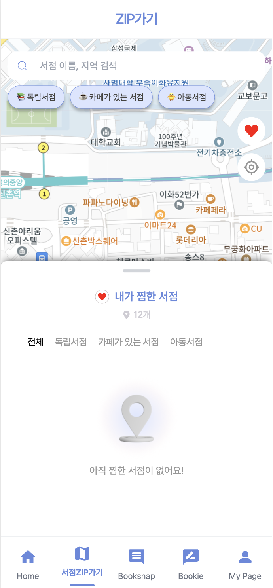
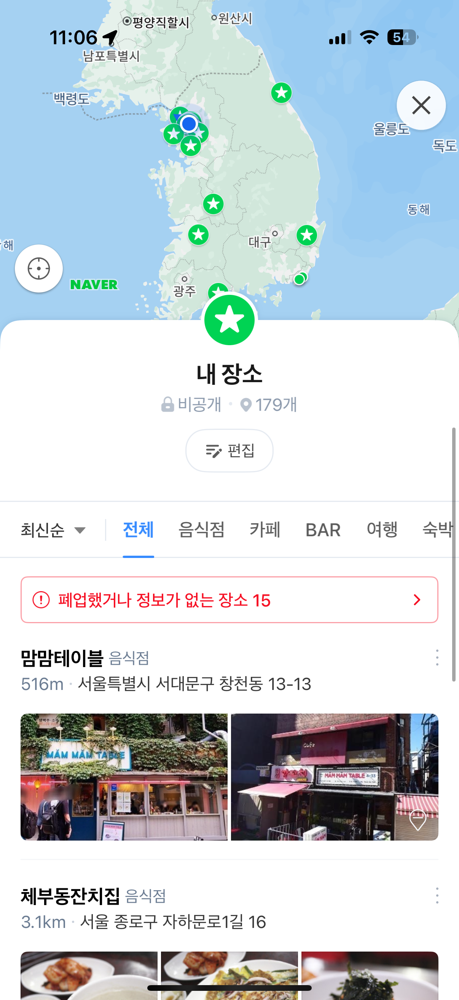

# 바텀시트 구현기

ID: TSK4-3

## 1. 바텀시트란?

내가 졸업 프로젝트에서 진행하고 있는 웹사이트는 웹앱이며, 지도를 사용하고 있다. 그래서 모바일 지도처럼 바텀시트가 필요했다. 바텀시트란 지도 애플리케이션에서 주로 사용하는 UI 요소로, 화면 하단에서 나타나는 패널을 의미한다.

바텀시트는 다양한 동작 방식이 있다. 예를 들어, 스크롤이 가능한 바텀시트, 단순히 올라오고 값을 선택하면 내려가는 바텀시트 등이 있다. 나는 그중에서도 스크롤이 가능한 바텀시트를 구현해야 했다…





## 2. drag and drop

처음에는 바텀시트를 올리고 내리는 과정이 ‘드래그’라고 생각해, `drag` 이벤트를 사용했다… 그리고 노트북에선 잘 동작했다. 그러나… 이 코드를 모바일에서 테스트해 보니, **잘 작동하던 `drag` 이벤트가 아예 실행되지 않았다….**

---

### 왜 모바일에서는 `drag`이벤트가 실행되지 않을까?

일단 터치와 드래그는 별개의 이벤트 시스템을 사용한다.

- **PC → `drag` 이벤트 (`dragstart`, `dragover`, `drop`)**
- **모바일 → `touch` 이벤트 (`touchstart`, `touchmove`, `touchend`)**

그리고, 모바일의 모든 동작은 기본적으로 터치 이벤트를 **(`touchstart`, `touchmove`, `touchend`)를 우선 처리한다**. 그래서 **모바일에서는 손가락을 움직이는 순간, `touchmove`가 우선 실행되어 `drag` 이벤트가 무시되는 것었다...**

그래서 `drag` 이벤트를 감지하려면 기본 터치 이벤트를 막아야겠다고 생각했다… 근데 생각해보니 모바일은 `wheel` 이벤트보다 `touch` 이벤트가 우선되기 때문에 기본 터치 이벤트를 막으면 **바텀시트 내에서 스크롤이 불가능해지는 문제**가 발생할 수 있다는 것을 깨달았다…

그래서 `drag` 이벤트가 아니라 **터치 이벤트(`touchstart`, `touchmove`, `touchend`)를 사용하는 방식으로 바텀시트를 수정해야겠다고 생각했다!**

## 3. `touch` 이벤트를 활용한 드래그 구현

일단 touch event 3가지를 통해 다음과 같이 구현해야겠다고 생각했다.

1. `touchstart`: 사용자가 바텀시트를 터치하면, **터치 시작 위치를 저장**
2. `touchmove`: 손가락을 위/아래로 움직이면, **바텀시트가 따라 움직이도록 설정**
3. `touchend`: 손을 떼면, **바텀시트가 `max`, `mid`, `close` 상태로 자동 정렬(스냅 기능)**

---

### **📌 Step 1: 터치 시작 위치 저장 (`touchstart`)**

사용자가 바텀시트를 **터치한 시점의 Y 좌표를 저장**해야 한다.

이 값을 기준으로 이후 `touchmove`에서 이동 거리를 계산할 것이다.

```tsx
const handleTouchStart = (e: TouchEvent) => {
  const { touchStart } = metrics.current;
  touchStart.sheetY = sheet.current!.getBoundingClientRect().y; // 현재 바텀시트 Y 좌표 저장
  touchStart.touchY = e.touches[0].clientY; // 터치한 위치의 Y 좌표 저장
};
```

✅ **바텀시트의 현재 Y 좌표 `touchStart.sheetY` 저장**

✅ 터치한 위치의 Y 좌표 `startY.current` 를 저장하여 **터치 시작 위치를 기억**

---

### **📌 Step 2: 손가락을 움직이면 바텀시트가 따라 이동 (`touchmove`)**

손가락을 위/아래로 이동하면, **현재 터치 위치와 터치 시작 위치를 비교하여 `deltaY` 값을 계산**해야 했다

이 `deltaY`를 바텀시트의 `transform` 값에 반영하면, 바텀시트가 부드럽게 따라오도록 만들 수 있다.

그래서 이 함수는 크게 **드래그 방향을 정하는 로직**과 **바텀시트를 이동시키는 로직**으로 나뉜다.

---

## **1️⃣ 드래그 방향을 정하는 로직**

손가락이 위로 움직였는지, 아래로 움직였는지를 판단하는 과정이다.

```tsx
if (touchMove.prevTouchY === undefined || touchMove.prevTouchY === 0) {
  touchMove.prevTouchY = touchStart.touchY; // 초기 터치값 설정
}

if (touchMove.prevTouchY < currentTouch.clientY) {
  touchMove.movingDirection = "down"; // 아래로 드래그
} else if (touchMove.prevTouchY > currentTouch.clientY) {
  touchMove.movingDirection = "up"; // 위로 드래그
}
```

✅ `prevTouchY`가 없거나 0이면 초기값 설정

✅ 이전 터치 위치(`prevTouchY`)와 현재 터치 위치(`currentTouch.clientY`)를 비교하여 **위/아래 방향을 결정**

---

## **2️⃣ 바텀시트를 움직이는 로직**

드래그 방향이 정해지면 손가락 이동 거리를 계산하여 바텀시트를 움직인다.

```tsx
if (canUserMoveBottomSheet()) {
  e.preventDefault(); // 기본 스크롤 이벤트 차단

  const touchOffset = currentTouch.clientY - touchStart.touchY;
  let nextSheetY = touchStart.sheetY + touchOffset;

  if (nextSheetY <= MIN_Y) nextSheetY = MIN_Y;
  if (nextSheetY >= MAX_Y) nextSheetY = MAX_Y;

  sheet.current!.style.setProperty(
    "transform",
    `translateY(${nextSheetY - MAX_Y}px)`
  );
} else {
  document.body.style.overflowY = "hidden";
}
```

✅ `touchOffset`을 계산해 **바텀시트가 손가락을 따라 이동하도록 설정**

✅ `MIN_Y`, `MAX_Y`를 이용해 이동 가능한 범위를 제한

✅ `translateY`를 사용해 부드럽게 이동 적용

✅ 이동 중 `body` 스크롤을 막아 사용성이 더 좋아짐

---

### **📌 Step 3: 손을 떼면 바텀시트가 특정 위치로 정렬 (`touchend`)**

이 함수는 **사용자가 드래그를 끝냈을 때 바텀시트를 적절한 위치로 이동**시키는 역할이다.

- **현재 바텀시트의 위치(`currentSheetY`)와 이동 방향(`movingDirection`)을 확인하여 자동 정렬(Snap Animation)**을 적용한다.

---

## **1️⃣ 바텀시트의 현재 위치 확인**

```tsx
const currentSheetY = sheet.current!.getBoundingClientRect().y;
```

✅ **바텀시트의 최상단 Y 좌표(`currentSheetY`)를 가져옴**

✅ 이를 통해 바텀시트가 현재 어느 위치에 있는지 확인할 수 있음

---

## **2️⃣ 바텀시트가 최대로 올라간 상태가 아니라면 이동 적용**

```tsx
if (currentSheetY !== MIN_Y) {
```

✅ 바텀시트가 이미 **최상단(`MIN_Y`)에 있다면 추가적인 이동이 필요 없음**

✅ 그렇지 않다면, **현재 손가락 이동 방향(`movingDirection`)에 따라 이동할 위치를 결정**

---

## **3️⃣ 손가락 방향에 따른 바텀시트 이동**

```tsx
if (touchMove.movingDirection === "down") {
  sheet.current!.style.setProperty("transform", "translateY(65px)");
}
```

✅ **손가락을 아래로 드래그(`down`)하면 바텀시트가 원래 위치(닫힘)로 내려감**

```tsx
if (touchMove.movingDirection === "up") {
  sheet.current!.style.setProperty(
    "transform",
    `translateY(${MIN_Y - MAX_Y}px)`
  );
}
```

✅ **손가락을 위로 드래그(`up`)하면 바텀시트가 최상단(`max`)으로 올라감**

---

## **4️⃣ 드래그 종료 후 상태 초기화**

```tsx
metrics.current = {
  touchStart: { sheetY: 0, touchY: 0 },
  touchMove: { prevTouchY: 0, movingDirection: "none" },
  isContentAreaTouched: false,
};
```

✅ 바텀시트의 위치를 결정한 후 **이전 터치 데이터를 초기화**

✅ 다시 새로운 터치 이벤트가 시작될 때 **정상적으로 동작하도록 리셋**

## 4. 결론 및 그 후 문제점들

이 방식으로 모바일에서도 바텀시트를 자연스럽게 드래그할 수 있도록 구현했다. 사실 이미 올라와있는 코드를 만힝 참고하였다… 하지만 추가적인 문제들이 있었다.

1. 현재 구현 방식에서는 바텀시트의 열림(`max`)과 닫힘(`close`) 상태만 존재한다. **중간 상태(`mid`)를 추가해야 했다.** → 해결 완료!
2. **스크롤이 되지 않는 문제**가 발생했다. 가로 스크롤은 되지만 세로 스크롤이 무시되는 문제가 있다. 모든 방법을 시도해봤지만 해결하지 못했다.

이 문제들을 해결하면 추가로 정리할 예정이다.
