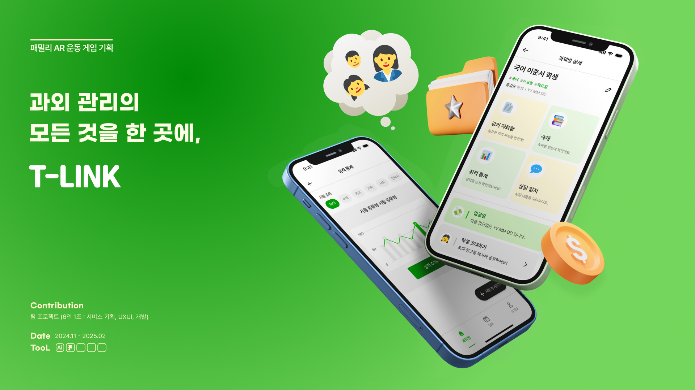

# 코테이토 회고글

코테이토에서 9기, 10기로 1년동안 활동하면서 느낀 점을 회고하는 글이다. 10기 끝나자마자 쓰려고 했는데 좀 늦었다…

---

## 🥔 코테이토에 들어가게 된 계기

사실 정확히 기억이 나지 않는다. 2학년 겨울방학 때 프론트를 처음 시작한 나는 혼자 1-2개월 정도 클론 코딩을 한 후, 코테이토에 지원했다. 일단 내가 경험이 없기도 했고, 다른 동아리와 달리 감자를 모집한다는 홍보글에 끌렸던 것 같다. 그래서 코테이토에 지원하게 됐다.

그리고 면접 때가 아직도 생생한데, 정말 많이 떨었다. 가기 전에 기술 질문 모음 같은 걸 엄청 찾아보고 갔었는데, 기술 질문은 하나도 없었다… 지금 생각해보면 내가 열정 감자 포지션으로 뽑혔기 때문인 듯… ‘얘가 뭘 알겠어…’라는 생각으로 기술 질문을 안 하신 게 아닐까… 그리고 면접은 3:2였는데, 같이 면접 보신 분이 정말 잘해서 나오자마자 떨어졌다고 확신했었다. 그러나 역시 면까몰… 합격했다는 걸 광화문 한가운데서 놀다가 확인했었는데, 정말 놀랐고 기뻤었다.

코테이토에 들어갈 때 구체적인 목표는 없었던 것 같다. 그냥 체계적으로 프론트를 배우고 싶다, 1인분을 하고 싶다 정도? 사실 뭐 아는 게 있어야 목표도 세우는데, 아는 게 없으니(그 당시 난 React도 해본 적 없었음…) 그냥 막연히 프론트를 배우고 싶고 프로젝트를 해보고 싶다는 마음뿐이었다.

## 🌱 9기: 성장통 프로젝트

9기 때는 들어가자마자 React 스터디에 참여했다. 프로젝트는 참여하지 않았는데 React도 모르는데 플젝을 들어가는 게 너무 힘들 것 같아서였다. 그런데… 단기였던 React 스터디가 끝나고 5월쯤 한 언니에게서 연락이 왔다. 언니가 있는 플젝에서 프론트 한 명을 더 구하는데, 나보고 할 생각 있냐는 내용이었다. 마침 딱 종강하고부터 개발을 시작한다길래 한다고 했다…

그렇게 들어간 첫 플젝… 지금 생각하면 다사다난했다. 일단 개발 기한이 촉박했고(3달?) 제대로 된 플젝은 처음이었기 때문에 많이 헤맸었다. 이때는 내가 API를 연동하고 어떤 사이트 하나를 만든 것만으로도 기뻤다. 정말 이렇게 꾸준히 무언가를 열심히 해본 건 정말 오랜만이었다. 그러나… 지금 보면 리팩토링할 것 투성이다. 조만간 할 예정이다. 이때는 실력이 늘었다기보다는 협업을 어떻게 하는지, 프로젝트에서 프론트엔드의 역할이 무엇인지 배운 것 같다. 그리고 기본적인 프로젝트 세팅과 흐름 정도? 정말 좋은 경험이었다고 생각한다. 첫 프로젝트였음에도 불구하고 잘 끝낼 수 있었던 건, 백엔드와 기획, 디자인이 잘 짜여 있었기 때문인 것 같다.

[https://github.com/yongaricode/9th-Growing-Pain-FE](https://github.com/yongaricode/9th-Growing-Pain-FE)

---

## 🎓 10기: 교육팀원에서 교육팀장으로

사실 10기를 하려고는 했는데, 교육팀장을 맡게 되었다. 9기 때 교육팀에 지원했었는데, 코테이토 교육팀은 커피챗을 하고 나서야 들어갈 수 있어서 정말 고민했었다. 그런데 한 교육팀 언니의 꼬심(?)에 넘어가서 지원하게 되었고, 그렇게 교육팀에 합류하게 되었다.

첫 발표 때는 정말 떨려서 대본만 계속 쳐다봤던 것 같다. 말도 자꾸 빨라져서 교육팀장님이 천천히 하라고 사인까지 보내주셨다…ㅎㅎ 지금 생각해보면 그때가 가장 긴장했던 순간이었던 것 같다.

---

### 배운 것들

교육팀을 6개월 동안 하면서 교육팀장님께 많은 것을 배웠다. 직접적으로 가르침을 받았다기보다는 교육팀장님의 PPT나 발표를 보면서, 저렇게 하면 집중이 잘 되고 이해가 잘 되는구나 하고 느끼고 따라 했던 것 같다. 9기에서 마지막으로 했던 발표 날, 교육팀장 오빠가 차기 교육팀장으로 나를 시켜도 되겠다고 생각했다고 한다… 아마 교육팀장님을 많이 따라 했던 게 만족스러우셨던 게 아닐까 싶다.

그렇게 10기에서 교육팀장을 맡게 되었다. 일단 OT 때 Git/Github 교육을 진행했는데, 여태 했던 교육 중에 두 번째로 떨렸다. (첫 번째는 첫 발표) OT라는 특성상 부담이 컸고, 잘해야 우리 동아리의 인상이 좋아질 텐데… 라는 생각에 고민을 많이 했다. 그래서 8기와 9기의 OT PPT를 모두 참고해 발표 자료를 제작했다. 내용은 거의 비슷했지만, 내가 Git을 처음 배울 때 이해가 잘 안됐던 부분들에, 이해를 돕는 여러 이미지를 추가해서 피피티를 만들었다. 결과적으로는 나름 나쁘지 않았던 것 같다… (고생각한다)

---

### 교육팀장으로서의 고민

교육팀원일 때는 사실 내 발표에만 신경 쓰면 됐다. 남의 발표 때는 자료를 읽어보고 적당히 이해한 뒤, 문제만 만들면 됐었다. 그런데 교육팀장이 되니까, 내 발표든 남의 발표든 적당히가 아니라 제대로 이해하고, 문제를 만든 뒤 팀원들의 문제까지 점검해야 했다. 난이도가 어떤지, 문제에 오류가 있는지 이런 것들도 봐야 했기 때문에 공부를 열심히 해야 했다. 이 과정에서 CS 지식을 점검할 수 있어서 좋았다.

교육팀장으로 1년을 보내면서 가장 크게 변한 건 사람들의 반응을 살피는 것이었다. 원래는 나의 발표에만 집중했는데, 이제는 사람들의 반응을 신경 쓰게 되었다. 주제나 내용의 난이도가 높거나 너무 지엽적이면 사람들의 집중력이 떨어진다는 걸 깨달았다. 그래서 듣는 사람들을 고려해 주제나 내용을 정하게 되었다. 만약 주제가 난이도가 좀 있다면, 내용을 개념과 필요성 위주로 설명하게 되었다.

또, 이건 이전 교육팀장님이 중요하게 생각했던 부분인데, 발표의 흐름을 생각하는 법을 배우게 되었다. 원래는 내가 공부한 내용의 나열… 정보의 연속이었다. 그런데 발표 시간은 짧고, 내가 전달하고 싶은 내용을 정확히 정해서 전달해야 했다. 더구나 디자이너와 기획자도 발표를 듣기 때문에 주제의 필요성과 등장 배경부터 설명하게 되었다.

보통은 주제를 설명하고, 동작 과정이나 주요 내용을 설명한 뒤, 장점이나 단점 같은 부가적인 내용은 간략하게 마무리하는 흐름이었다. 이게 생각보다 중요한 것 같다. 예를 들어, 어떤 것의 종류나 장점, 단점만 나열하면 발표가 지루해진다. 발표 시간과 교육 목표를 고려해 필요한 정보만 정확히 전달하는 게 중요하다는 걸 깨달았다.

---

### 교육팀에서 얻은 것

교육팀장을 맡으면서 단순히 발표를 잘하는 법뿐만 아니라, 어떻게 하면 듣는 사람들에게 효과적으로 전달할 수 있을지에 대해 고민하게 되었다. 주제를 정할 때도, 발표 자료를 만들 때도, 사람들의 반응을 보면서 계속 개선해나갔다.

이제는 발표를 준비할 때마다 "이 내용이 왜 중요한가?", "어떻게 설명해야 잘 이해할 수 있을까?"를 먼저 생각하게 된다. 교육팀에서의 경험은 앞으로도 발표를 할 때나 팀원들과 소통할 때 큰 도움이 될 것 같다.

---

## 👩‍🏫 10기 : T-Link

10기에서도 새로운 프로젝트에 들어가게 되었다. 처음에는 공모전을 준비했었는데 아쉽게도 떨어지고 말았다. 그래서 기획과 새로운 디자이너를 영입해 프로젝트를 기획 단계부터 다시 구상하게 되었다. 9기 프로젝트 때는 중간에 투입되어 이미 기획과 디자인이 얼추 끝난 상태였기 때문에 몰랐는데, 이번에 처음부터 기획을 해보니 기획이란 정말 어려운 작업이라는 걸 깨달았다. 모두가 만족할 만한 기획이란 없는 것 같고, 서비스를 구체화하는 것도 만만치 않은 일이라는 생각이 들었다.

그렇게 새로운 주제로 프로젝트를 다시 시작했는데… 정말 감사하게도 정말 능력 있는 디자이너가 팀에 들어왔다. 프론트엔드 개발자로서 사실 디자인이 잘 되어 있지 않으면 개발할 때 의욕이 떨어지는 게 사실이다... (여기서 말하는 디자인은 정말 말 그대로의 디자인이 아니라, 피그마 개발 모드에서 볼 수 있는 체계적인 디자인을 말한다.)

졸업 프로젝트를 할 때 우리가 직접 디자인을 했어야 했는데, 그때 디자이너의 중요성을 뼈저리게 느꼈다. 그래서 이번 프로젝트를 하면서 정말 감사한 마음으로 디자이너와 협업했다. 깔끔하고 직관적인 디자인 덕분에 개발하는 데에도 훨씬 수월했다. 디자이너가 얼마나 중요한 역할을 하는지 다시 한 번 느낄 수 있었다.

백엔드 팀도 요구사항을 굉장히 잘 들어주고, 수정도 빠르게 해줘서 프로젝트를 수월하게 진행할 수 있었다. 9기 때는 기능 완성에 급급해 코드 퀄리티는 생각할 겨를이 없었는데, 이번에는 서로 코드 리뷰도 해주고, 조금 더 좋은 코드를 작성하기 위해 노력했다.

프로젝트가 끝난 후, 이제는 리팩토링을 할 예정이다! 사실 10기는 끝났지만 이번 프로젝트를 계속 하고 싶었는데, 팀원들이 다들 할 생각이 없는 것처럼 보여서 조금 슬펐다. 그런데 용기 내서 카톡을 보내보니 다들 같이 하겠다고 해서 정말 기뻤다. 앞으로 3주간 리팩토링을 하고, 새로운 기능도 몇 가지 도입할 예정이다.

9기 때는 단순한 기능 하나를 구현하는 것도 힘들었는데, 이번에는 기능 구현을 넘어서서 어떻게 하면 더 좋은 코드를 작성할 수 있을지 고민하고 있는 나 자신이 신기하다. 확실히 프로젝트를 하면서 조금씩 성장하고 있다는 걸 실감하고 있다.

[https://github.com/IT-Cotato/10th-T-LINK-FE](https://github.com/IT-Cotato/10th-T-LINK-FE)

---

## 😭 코테이토를 떠나며

그리고 10기를 마지막으로 코테이토를 나왔다… 사실 더 하고 싶었는데, 졸업 프로젝트도 있고, 10기 때 했던 T-Link도 몇 개월 간은 계속할 예정이라 새로운 프로젝트에 들어갈 수가 없어서 나오게 되었다. 정말 아쉬워서 마지막까지 고민했지만, 어쩔 수 없었다…ㅜㅜ

비록 나오게 되었지만, 코테이토는 나의 개발 첫걸음을 함께한 동아리이고, 좋은 사람들을 많이 만날 수 있었던 곳이라 앞으로도 정말 의미 있는 동아리로 남을 것 같다. 함께 했던 프로젝트들과 팀원들, 그리고 교육팀 활동까지… 정말 소중한 경험들이었다.

---

### 1인분은 할 수 있는 것 같지만…

코테이토에 들어올 때는 프론트엔드로서 더 배우고 싶고, 1인분은 해내고 싶다는 마음이 강했다. 이제는 어느 정도 1인분은 할 수 있게 된 것 같아서 목표를 이룬 것 같긴 하다! 그러나 솔직히 말하면, 막상 깊이 파보면 1인분 같은 0.7인분인 것 같다… 아니면 1인분은 1인분인데, 라면 1인분 같은 느낌?

그러니까, 양은 맞는데 퀄리티가 아쉽다는 이야기다…

그래서 당분간은 새로운 프로젝트를 시작하기보다는, 지금까지 했던 것들을 돌아보고 리팩토링하고, 부족한 부분을 채우는 시간을 가질 생각이다. 그동안 쌓아온 코드들과 경험을 더 깔끔하고 효율적인 코드로 다듬어보는 것도 좋은 공부가 될 것 같다.

---

### 작년의 가장 잘한 선택: 코테이토에 들어간 것

지금 생각해보면 작년에 했던 선택 중에 제일 잘한 건 코테이토에 들어간 거였다.

코테이토를 통해 프론트엔드에 대한 체계적인 공부를 할 수 있었고, 프로젝트와 협업의 중요성도 많이 배웠다. 무엇보다 좋은 사람들을 많이 만날 수 있었던 게 정말 큰 행운이었다.

앞으로도 코테이토에서 배운 것들을 잘 활용해서 성장해 나가고 싶다.

코테이토 화이팅~~~! 🎉

